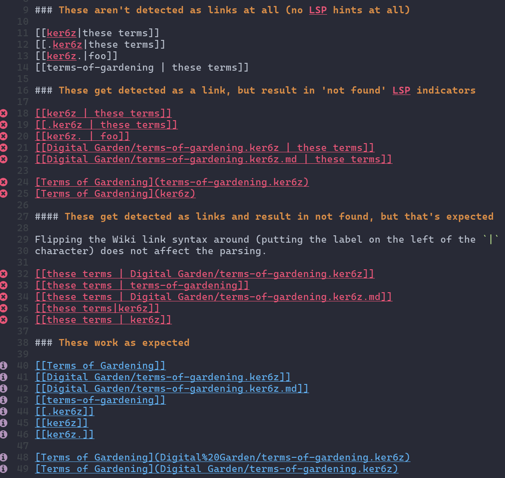

Experimenting with various link syntaxes to see how
[`zk`](https://github.com/mickael-menu/zk) parses it. Hopefully this will help
debugging [issue #98](https://github.com/mickael-menu/zk/issues/98).

See the experiment files:

* [Experiments One](experiments-one.xci1f.md)
* [Experiments Two](experiments-two.muimd.md)

This is what the errors look like in my editor, Neovim:

